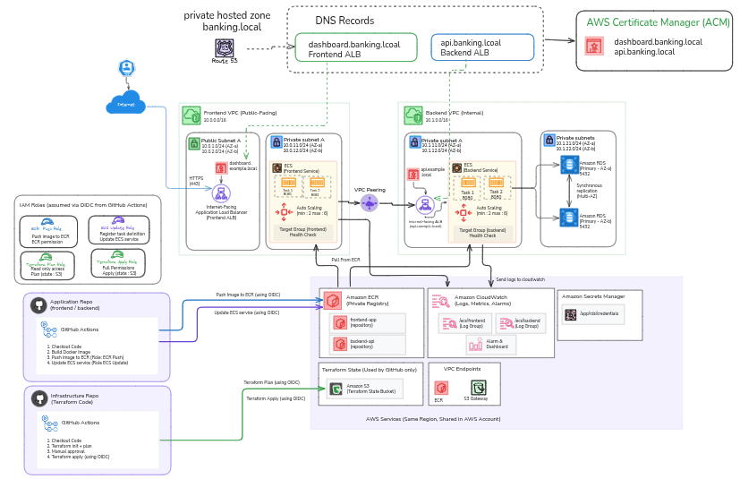

# Banking Infrastructure on AWS

Terraform infrastructure for a banking application with a Blazor frontend,
an ASP.NET Core API, and PostgreSQL. Application source and container builds
live in the separate [banking-app repository](https://github.com/HninPhyuPhyuAung-hub/banking-app).
This repository manages the AWS infrastructure, not the banking business logic.

## Problem statement

A banking application needs a repeatable deployment environment that separates
the user interface, API, and database. Exposing all three tiers publicly or
configuring them manually makes access control, scaling, and deployments
harder to maintain.

This assignment uses infrastructure as code to provide a controlled frontend
entry point, private application and database tiers, encrypted storage,
HTTPS listeners, centralized logs.
It is a development reference architecture, not a production banking
compliance certification.

## Requirements and implementation

| Requirement | Implementation |
|---|---|
| Separate frontend and backend applications | Two ECR repositories and two ECS Fargate services |
| Separate network tiers | Frontend and backend VPCs connected through same-region peering |
| Keep application tasks and database private | Private task subnets, no task public IPs, isolated database subnets |
| Route frontend requests to the API | Public frontend ALB and internal backend ALB |
| Provide HTTPS | ACM certificates issued by a Terraform-managed AWS Private CA |
| Store relational data with availability protection | PostgreSQL RDS with Multi-AZ primary/standby deployment |
| Protect database credentials and encrypt stored data | Secrets Manager for credentials; KMS encryption for RDS, ECR, and S3 Terraform state |
| Scale the application | CPU target tracking at 60%, independently scaling each service from 1 to 4 tasks |
| Support diagnostics | CloudWatch task logs, Container Insights, and ECS Exec |
| Make changes reproducible | Reusable Terraform modules, remote state locking, and GitHub Actions with OIDC |

## Architecture



**Temporary placeholder:** the current image is a CloudWatch log screenshot.
Replace it with the architecture diagram at the same path.

Request flow:

```text
Client
  -> frontend public ALB (HTTPS 443)
  -> Blazor tasks (HTTP 8081, frontend private subnets)
  -> backend internal ALB (HTTPS 443, over VPC peering)
  -> ASP.NET Core tasks (HTTP 8080, backend private subnets)
  -> PostgreSQL RDS (TCP 5432, backend database subnets)
```

- Region: `ap-southeast-1`; availability zones: `1a` and `1b`.
- Frontend VPC: `10.0.0.0/16`; backend VPC: `192.168.0.0/16`.
- Neither task tier uses NAT. Private endpoints provide ECR, Logs, ECS Exec,
  and backend Secrets Manager access. S3 gateway endpoints provide image layers.
- Only application private-subnet route tables participate in peering.
  Database route tables do not route to the frontend VPC.
- The frontend ALB is internet-facing, but its hostname is in a **private**
  Route 53 zone and its certificate uses a **private** CA. This is not an
  out-of-the-box public website: clients need private DNS access and CA trust.
- HTTPS terminates at each ALB; ALB-to-container traffic is HTTP.

## What the code does

### Independently managed stacks

| Directory | Purpose | Remote state key |
|---|---|---|
| [infra/pca](./infra/pca/) | Creates a root CA, signs/imports its root certificate, and permits ACM issuance | `pca/terraform.tfstate` |
| [infra/ecr](./infra/ecr/) | Creates API/dashboard image repositories, KMS encryption, scan-on-push, and untagged-image cleanup | `ecr/terraform.tfstate` |
| [infra/envs/dev](./infra/envs/dev/) | Composes networking, DNS, certificates, ALBs, ECS, and RDS | `dev/terraform.tfstate` |

Dev reads the PCA ARN and ECR repository URLs through Terraform remote-state
outputs. State uses the versioned, KMS-encrypted S3 bucket
`banking-app-tfstate-439475769687` with native `.tflock` locking.
S3/IAM bootstrap instructions are in [infra/s3/notes.md](./infra/s3/notes.md).
Bootstrap is intentionally outside these Terraform stacks.

### Reusable modules

| Module | Responsibility |
|---|---|
| [vpc](./infra/modules/vpc/) | VPC, subnets, route tables, and optional internet/NAT gateways |
| [vpc_peering](./infra/modules/vpc_peering/) | Peering connection and application-subnet routes |
| [alb](./infra/modules/alb/) | ALB security group, HTTPS listener, and IP-type target group |
| [ecs_service](./infra/modules/ecs_service/) | Task roles, container definition, private Fargate service, logs, ECS Exec, and autoscaling |
| [ecs_endpoints](./infra/modules/ecs_endpoints/) | Private AWS service endpoints and restricted S3 image-layer access |
| [rds](./infra/modules/rds/) | PostgreSQL, database security group, encryption key, and connection-string secret |

[network_access.tf](./infra/envs/dev/network_access.tf) connects the tiers
using explicit security-group rules rather than unrestricted egress.
[terraform.tfvars](./infra/envs/dev/terraform.tfvars) supplies dev network,
port, image-tag, and capacity values. Each service starts at two tasks with
256 CPU units and 512 MiB memory; autoscaling owns desired count afterwards.
Rolling deployments permit up to 200% of desired capacity temporarily.

### GitHub Actions

[terraform.yml](./.github/workflows/terraform.yml) uses short-lived AWS
credentials through GitHub OIDC:

- Same-repository PRs to `main`: plan PCA, ECR, and dev; no apply.
- Matching pushes to `main`: apply **PCA -> ECR -> dev**, subject to the
  `infra-dev` environment's configured approval rules.
- Manual runs on `main`: select `pca`, `ecr`, `dev`, or `all`.
- Automatic triggers match Terraform configuration/variables, provider
  lock files, the helper script, and this workflow. README/notes-only
  changes do not trigger it.

[terraform-workflow.sh](./infra/terraform-workflow.sh) initializes and
validates each selected stack, creates a saved plan, and applies that exact
plan for deployments. Before prerequisite state exists, a PR dev plan is
explicitly reported as **NOT RUN**; deployment fails instead of pretending
to succeed. Concurrent deployment jobs are serialized.

Each run also uploads build artifacts: PR plan jobs attach a rendered
`terraform show` of the plan per stack (`terraform-plan-<stack>-<attempt>`,
7-day retention); deploy jobs attach `terraform output -json` per applied
stack (`terraform-outputs-<attempt>`, 90-day retention) so DNS names, ECR
URLs, and similar outputs don't require digging through job logs.

Terraform creates ECR repositories but does not build images. ECR image
pushes do not trigger this workflow or automatically replace running ECS
tasks; application delivery belongs to the application repository.

## Setup and operation

Use [notes.md](./notes.md) for prerequisites, GitHub variables, deployment
order, health checks, logs, ECS Exec, and cleanup guidance.

Important limitations:

- RDS Multi-AZ uses a standby for availability, **not a read replica**.
- Application containers must implement `/health` and match Terraform's
  ports and configuration names.
- Private CA trust must be installed in clients, including the frontend
  image when it calls the API.
- Secrets Manager does not remove secrets from Terraform state. Restrict
  state, plan, and log access; never commit secrets or saved plans.
- Private CA, ALBs, Multi-AZ RDS, Fargate, and interface endpoints incur
  ongoing charges. Review costs before leaving the environment running.
